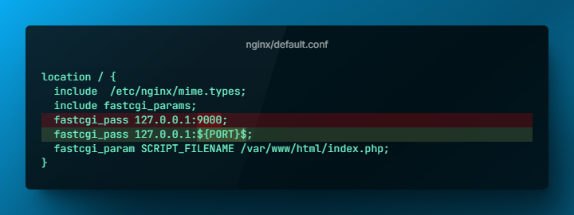

<div align="center">





</div>

## Use Cases
- Dynamically modifiy static config files based on user input
- Replace placeholder with custom eval'd JavaScript at runtime
- Start specific service conditionally on docker run arguments. 
- and many more...
## Installation

#### Using Precompiled binaries

Precompiled binaries for
- Windows x64
- Linux x64, arm64 and Alpine x64
- MacOS x64, arm64

are published every [release](https://github.com/adrianschubek/ufpp/releases) and are also available in [/dist](/dist/) folder.

Move the executable to `/usr/local/bin` for easier CLI access: `sudo mv <your-file> /usr/local/bin/ufpp`

#### Compile binaries yourself

1. clone this repo
2. run `npm install`
3. run `tsc` to compile TypeScript files
4. run `npm run pack`
5. binaries for various platforms are compiled in `/dist`

Move the executable to `/usr/local/bin` for easier CLI access: `sudo mv <your-file> /usr/local/bin/ufpp`

#### Using node (and tsc)

1. clone this repo
2. run `npm install`
3. run `tsc` to compile TypeScript files
4. run `node out/index.js`

## Usage

```
Universal File Pre-Processor ('ufpp') is a tool for preprocessing any file

Usage: ufpp [options] <file> [variables]

Positionals:
  file, f  the file to preprocess                                       [string]

Options:
      --help     Show help                                             [boolean]
      --version  Show version number                                   [boolean]
  -o, --output   the output file                    [string] [default: "stdout"]
  -c, --check    checks/validates the file only       [boolean] [default: false]
  -v, --verbose  makes the preprocessor verbose       [boolean] [default: false]
  -q, --quiet    makes the preprocessor quiet         [boolean] [default: false]
      --no-eval  disables the eval function           [boolean] [default: false]
      --no-vars  disables the variables replacement   [boolean] [default: false]

Examples:
  ufpp -o out.txt input.txt    runs the preprocessor on input.txt and write
                               output to out.txt
  ufpp input.txt foo=bar       runs the preprocessor on input.txt and sets
                               variable foo to bar
  ufpp input.txt -m "<#" "#>"  runs the preprocessor on input.txt and write
                               output to out.txt with markers <# and #>
  ufpp -c input.txt            validates the syntax of input.txt file

for more info and support visit https://github.com/adrianschubek/ufpp
```
> Show this help page by running `ufpp`.

A variable can either be a `key=value` pair or just a `key`. Multiple variables can be passed as arguments by using spaces like `foo=bar foz="baz 123" foobar`.

### Syntax

#### Blocks

A (template) block can be declared by using one or more `$[<command>]$` statements where `<command>` is a valid command (see API reference below) and must end in a `$[end]$` statement. 

A block's statements are evaluated from top to bottom. If the result of a command is truthy, the guarded section will be outputted and all other commands in this block ignored. 

Otherwise this statement will be skipped and the next statement is evaluated. If no statement in this block is truthy, the `else` section will be outputted and if no `else` section is present, nothing will be outputted.

There can be any number of blocks declared in a file, but blocks **cannot** be nested.

#### Commands
A command generally follows this syntax `$[<name> [arg1] [arg2] ... [argN]]$` where `[arg]` is a [*Value*](#values). All commands return either `true` or `false`.

#### Values
- Values are treated as strings by default and cannot contain spaces.
- Values surrounded by `"` are treated as strings and can contain spaces.
- Values surrounded by `` ` `` (backticks) are evaluated using JavaScript's `eval` function. This means you can use any valid JavaScript expression inside.

#### Variables

A variable can be used inside a template block's *Value* by using its name. Variables are stored globally and changes to a variable can only affect statements declared **after** the current one. Outputting a variable can be done using `${<name>}$` (curly braces) where `<name>` is the variable's name.

*Example: test.txt*
```
foobar
$[if `1 + 2 == 4`]$
a
$[ifeq foo bar]$
b ${foo}$
$[else]$
c
$[end]$
```

Running this example with `ufpp test.txt foo=bar` will result in the following output:
```
foobar
b bar
```


### API

`if` 


## Roadmap
- [ ] custom markers
- [ ] no-template option
- [ ] include data from other files

<!-- 
any file with 

./tool test.txt --VAR=bla > out.txt

ifeq NAME VALUE
ifne (!=) NAME VALUE
iflt (<) NAME VALUE
ifgt NAME VALUE
ifge NAME VALUE
ifle (<=) NAME VALUE
ifdef NAME
ifndef NAME
else
endif
TODFO: print value echo

VALUE: foo
VALUE: "foo bar"
VALUE: `2+3` (backticks) will be interpreted (eval'd) as javascript

! NO nesting !

--- test.txt
$[ifeqs show bla didShow 1]$
  lol
$[if `1+2 == 5`]$
 aa
$[else]$
  bar
$[end]$

${foo}$ <- variable print

$[if "foo bar"]$

$[end]$

--- alternative same zeile TODO: roadmap

test $[ifeq foo bar]$baz$[end]$ 

$[if 1]$ 
a
$[else]$ 
b
$[end]$ -->